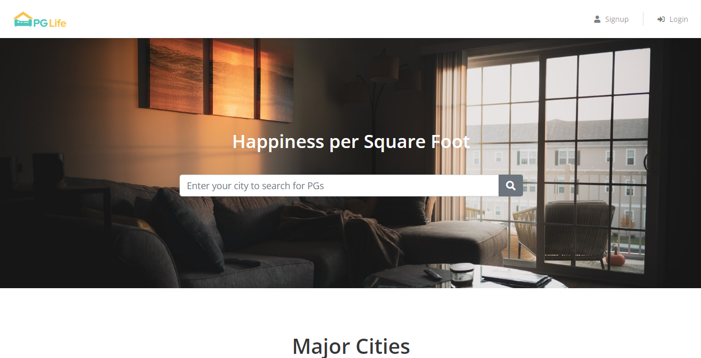
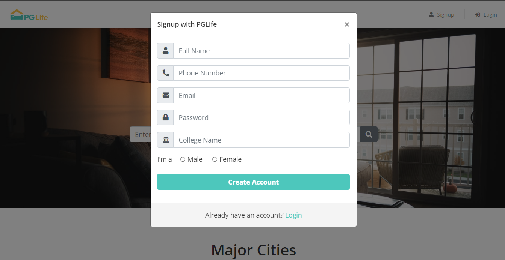
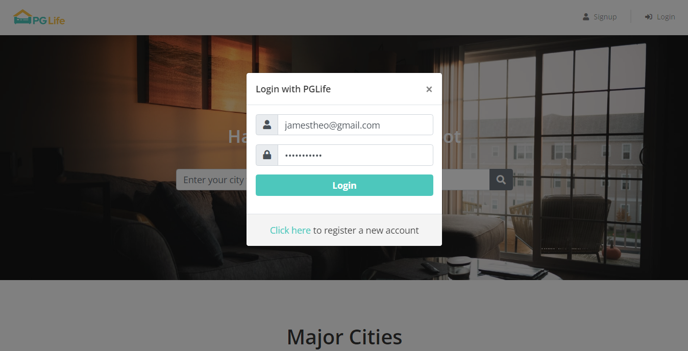
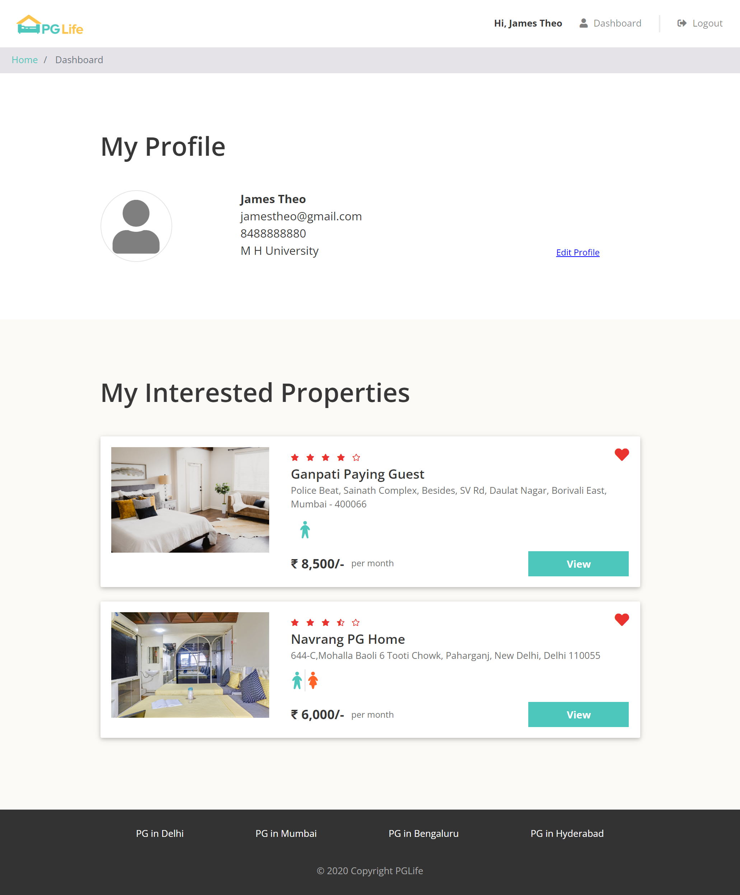
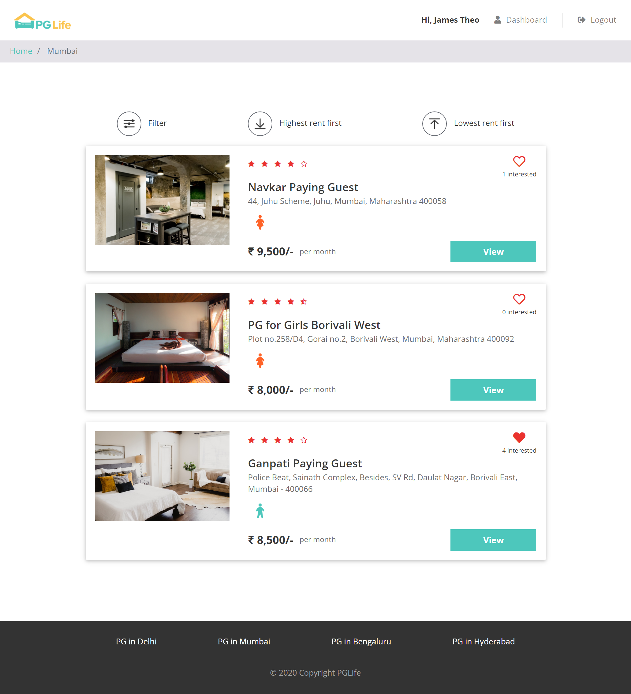
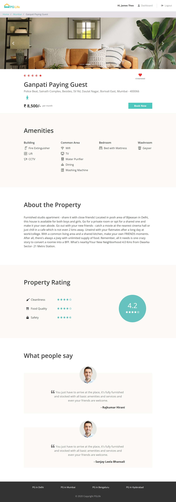

# PGLife | Homestay Bookings 🛏️

<samp> Final Project.  
Web Development Trainings.  
Internshala Trainings. </samp>

### Web Server |  Apache HTTP Server

### Database
    -- Download SQL file from database directory in repository.
    -- Create database in phpmyadmin named pglife.
    -- Import SQL file to database.

### Future Developments
<samp> 
&nbsp;&nbsp;&nbsp;-- Implement the filter modal in <b>property_list.php</b> page. 
</samp>

### Author | @[lizzencamelo](https://github.com/lizzencamelo/)

### PGLife Website Design

#### Home Page

#### SignUp Modal  

#### Login Modal   

#### Dashboard   

#### Property List Page  

#### Property Detail Page

